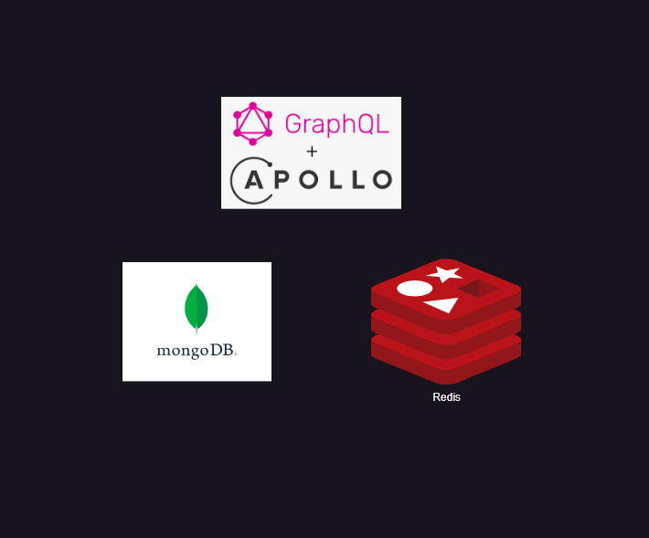

# Pokemon GraphQL API

This GraphQL API allows clients to query and filter Pokemons from the database


## Tech Stack

Typescript, GraphQL, Redis, MongoDB


## Screenshots



## Requirements

The requirements needed to run this project

- nodejs
- docker-compose

## Installation

Install npm depencencies

```bash
  npm install
```

## Running the project

Start the services in docker-compose (MongoDB, Redis)

```bash
  docker-compose up
```

Start the application (MongoDB, Redis)

```bash
  npm run build
  npm start
```


